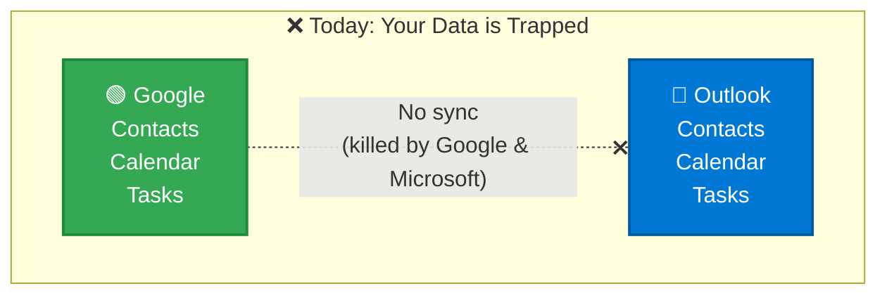
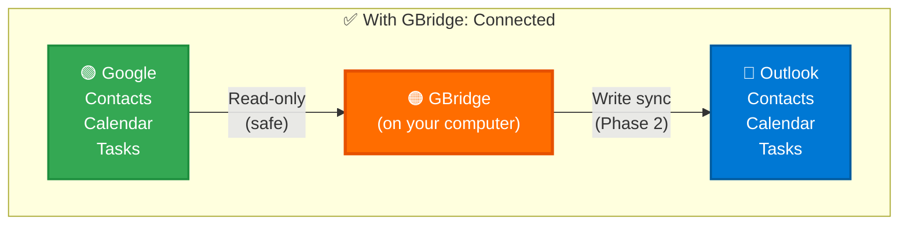
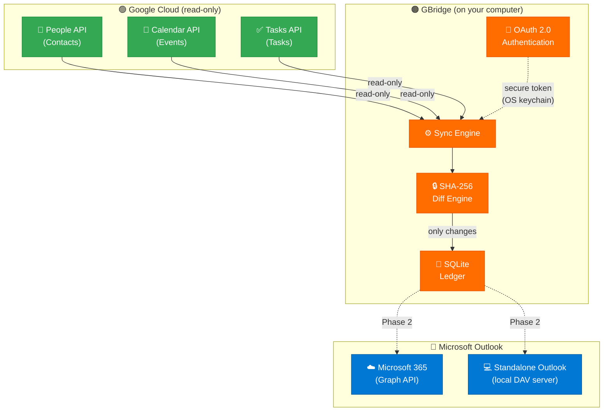
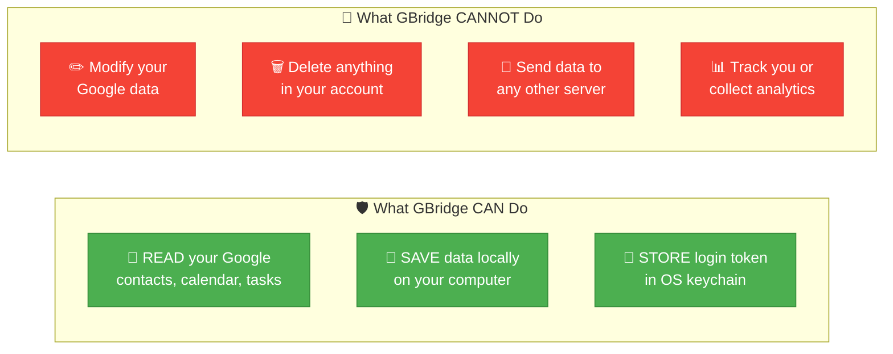

# GBridge

[](https://github.com/amitrintzler/GBridge/actions/workflows/ci.yml)
[](https://github.com/amitrintzler/GBridge/actions/workflows/security.yml)
[](https://github.com/amitrintzler/GBridge/blob/main/LICENSE)
[](https://www.python.org/downloads/)
[](#safety-guarantees)
[](https://github.com/amitrintzler/GBridge/blob/main/SECURITY.md)
[](https://github.com/amitrintzler/GBridge)

**Sync your Google Contacts, Calendar, and Tasks with Microsoft Outlook.**

GBridge is a free, open-source tool that keeps your Google and Outlook data in sync — automatically, securely, and without touching your existing data.

Created by **Amit Rintzler**.

---

## Why Does GBridge Exist?



**The problem is simple:** billions of people use Google for personal life and Outlook for work. Their contacts, calendars, and tasks live in two separate worlds that don't talk to each other.

**Why haven't Google or Microsoft fixed this?**

- **Google killed Google Sync** on December 14, 2012. It used Exchange ActiveSync to let Outlook connect directly to Google — they shut it down for all consumer accounts. ([Ars Technica](https://arstechnica.com/information-technology/2012/12/google-drops-exchange-activesync-support-for-free-accounts/), [The Verge](https://www.theverge.com/2012/12/14/3767626/google-drops-exchange-activesync-support-gmail))
- **Google also killed "Google Calendar Sync"** — their own desktop tool that synced Google Calendar with Outlook — discontinued in 2014. ([Google Support](https://support.google.com/calendar/answer/89955))
- **Microsoft never built native Google sync into Outlook.** Their only option is a read-only calendar subscription (ICS) — no contacts, no tasks, no two-way sync. ([Microsoft Support](https://support.microsoft.com/en-us/office/see-your-google-calendar-in-outlook-c1dab514-0ad4-4811-824a-7d02c5e77126))
- **Outlook desktop still doesn't support CalDAV/CardDAV** — the open standards that would make Google sync easy. Apple supports them natively. Microsoft chose not to.
- **Neither company has any incentive to help you use the other's product.** Google wants you in Gmail. Microsoft wants you in Outlook. Keeping your data siloed keeps you locked in. (The EU recognized this — the [Digital Markets Act](https://digital-markets-act.ec.europa.eu/) specifically targets interoperability failures by tech gatekeepers.)
- **Third-party "sync" tools exist, but they all have catches:**

  | Tool | Price | Catches |
  |---|---|---|
  | [SyncGene](https://www.syncgene.com/) | $4.95–9.95/month | Routes data through their cloud servers |
  | [CompanionLink](https://www.companionlink.com/) | $14.95/month | Closed source, proprietary |
  | [gSyncit](https://www.gsyncit.com/) | $19.99 one-time | Windows-only, closed source |
  | [Sync2 Cloud](https://www.sync2.com/) | $49.95 one-time | Closed source, Windows-only |

**The result?** Millions of non-technical users — like my father — are stuck manually copying contacts between their phone and work computer, missing calendar events because they're in the wrong app, or just giving up and accepting that their digital life is fragmented.

**GBridge fixes this.** It's free, open source, runs on your computer (your data never touches our servers — we don't even have servers), and it works. That's it. No subscription, no cloud middleman, no lock-in.



---

## Download & Install (No Technical Knowledge Needed)

### Windows

1. Download **`gbridge-windows.exe`** from the [Releases page](https://github.com/amitrintzler/GBridge/releases/latest)
2. Double-click the downloaded file
3. The setup wizard opens and walks you through everything

**That's it. No Python, no terminal, no technical steps.**

### macOS

1. Download **`gbridge-macos`** from the [Releases page](https://github.com/amitrintzler/GBridge/releases/latest)
2. Open Terminal (search "Terminal" in Spotlight)
3. Run: `chmod +x ~/Downloads/gbridge-macos && ~/Downloads/gbridge-macos setup`

### Linux

1. Download **`gbridge-linux`** from the [Releases page](https://github.com/amitrintzler/GBridge/releases/latest)
2. Open Terminal
3. Run: `chmod +x ~/Downloads/gbridge-linux && ~/Downloads/gbridge-linux setup`

---

## What Happens When You Run It

The setup wizard guides you through everything step by step:

```
GBridge v0.1.0 — Setup Wizard

========================================================
  Welcome! This wizard will set up GBridge for you.
  It takes about 5 minutes, and you only do it once.
========================================================

[Step 1/5] Checking Python version...
  Python 3.12.0 — OK

[Step 2/5] Google API credentials
```

If you haven't set up Google credentials yet, it shows you exactly what to click:

```
  +----------------------------------------------------------+
  |  STEP A: Create a Google Cloud Project                   |
  +----------------------------------------------------------+
  |                                                          |
  |  1. Go to: https://console.cloud.google.com              |
  |                                                          |
  |  2. Click the project dropdown at the top:               |
  |     +---------------------------------------------+      |
  |     | [v] Select a project          [NEW PROJECT] |      |
  |     +---------------------------------------------+      |
  |                                        ^^^^^^^^^^^       |
  |                                    Click "NEW PROJECT"   |
  |                                                          |
  |  3. Name it "GBridge" and click CREATE                   |
  +----------------------------------------------------------+

  +----------------------------------------------------------+
  |  STEP B: Enable the 3 APIs                               |
  +----------------------------------------------------------+
  |                                                          |
  |  In the search bar at the top, search for each API       |
  |  and click ENABLE:                                       |
  |                                                          |
  |  +----------------------------------------------------+  |
  |  | [Search] People API                                |  |
  |  +----------------------------------------------------+  |
  |     -> Click the result -> Click [ENABLE]                |
  |                                                          |
  |  Repeat for:                                             |
  |     [x] People API                                       |
  |     [x] Google Calendar API                              |
  |     [x] Tasks API                                        |
  +----------------------------------------------------------+

  +----------------------------------------------------------+
  |  STEP C: Create OAuth Credentials                        |
  +----------------------------------------------------------+
  |                                                          |
  |  1. In the left sidebar, click:                          |
  |     APIs & Services > Credentials                        |
  |                                                          |
  |  2. Click:  [+ CREATE CREDENTIALS]                       |
  |             > OAuth client ID                            |
  |                                                          |
  |  3. If asked for consent screen:                         |
  |     - Choose "External"                                  |
  |     - App name: "GBridge"                                |
  |     - Fill your email, click Save                        |
  |                                                          |
  |  4. Application type: [Desktop application]              |
  |     Name: "GBridge"                                      |
  |     Click [CREATE]                                       |
  |                                                          |
  |  5. On the popup, click:                                 |
  |     +----------------------------------+                 |
  |     |  [DOWNLOAD JSON]                 |                 |
  |     +----------------------------------+                 |
  |                                                          |
  |  6. Rename the downloaded file to:                       |
  |     client_secret.json                                   |
  +----------------------------------------------------------+
```

After you place the file and press ENTER, it finishes automatically:

```
[Step 3/5] Signing in to Google...
  Your browser will open. Sign in and click 'Allow'.
  Authenticated — OK

[Step 4/5] Running your first sync...
  Contacts       342 items synced
  Events         128 items synced
  Tasks           15 items synced

[Step 5/5] Outlook detection...
  No Outlook detected — Outlook sync coming in Phase 2

========================================================
  Setup complete! GBridge is ready.
========================================================

  What you can do now:

    gbridge          Run a sync (fetches latest from Google)
    gbridge status   See what's in your local sync ledger
    gbridge auth     Re-authenticate if needed

  Your Google data was NOT modified. GBridge only reads.
```

---

## How It Works



**Phase 1** (current): Reads from Google, detects changes, saves locally.
**Phase 2** (next): Writes to Outlook — either via Microsoft Graph API (M365) or a local DAV server (standalone Outlook).

## Key Features

- **Contacts** — syncs all your Google contacts
- **Calendar** — syncs all your Google calendar events
- **Tasks** — syncs all your Google tasks
- **Works with any Outlook** — Microsoft 365 (cloud) and standalone classic Outlook
- **Auto-detection** — GBridge figures out which Outlook you have automatically
- **Windows, macOS, and Linux**

## Safety Guarantees



GBridge is built with a **zero-risk** philosophy. Here's the proof — you can verify every claim yourself:

### 1. Read-only — it's impossible for GBridge to modify your Google data

These are the exact Google API scopes in our code ([`src/gbridge/config/defaults.py` line 13-15](https://github.com/amitrintzler/GBridge/blob/main/src/gbridge/config/defaults.py#L13-L15)):

```python
GOOGLE_SCOPES = [
    "https://www.googleapis.com/auth/contacts.readonly",
    "https://www.googleapis.com/auth/calendar.readonly",
    "https://www.googleapis.com/auth/tasks.readonly",
]
```

Every scope ends in `.readonly`. Google enforces this at the API level — even if our code tried to write, Google would reject it. You can also see this when you authorize GBridge: the Google consent screen will say **"View your contacts"**, not "Edit your contacts".

### 2. No guessing — tracked by unique Google IDs

Items are matched by their Google-assigned unique IDs ([`src/gbridge/core/engine.py` line 177-183](https://github.com/amitrintzler/GBridge/blob/main/src/gbridge/core/engine.py#L177-L183)):
- Contacts: `resource_name` (e.g. `people/c1234567890`)
- Events: `event_id`
- Tasks: `task_id`

No fuzzy name matching, no "best guess" merging. If the ID doesn't match, it's a different item.

### 3. Smart sync — SHA-256 hash proves what changed

Every item is fingerprinted with SHA-256 ([`src/gbridge/core/hasher.py`](https://github.com/amitrintzler/GBridge/blob/main/src/gbridge/core/hasher.py)). If the hash matches the last sync, the item is skipped. Only real changes trigger action.

### 4. Local-only — no external servers

Search the entire codebase for network calls: the only HTTP connections are to `googleapis.com` domains. There is no telemetry endpoint, no analytics SDK, no phone-home URL. Verify it yourself:

```bash
grep -r "http" src/gbridge/ --include="*.py" | grep -v "localhost" | grep -v "googleapis" | grep -v "google.com" | grep -v "github.com"
```

This returns nothing. Zero connections to anything except Google's official APIs.

### 5. Secure token storage — OS keychain, not files

Login tokens are stored via the `keyring` library ([`src/gbridge/google/auth.py` line 86-92](https://github.com/amitrintzler/GBridge/blob/main/src/gbridge/google/auth.py)):
- **Windows**: Windows Credential Locker
- **macOS**: macOS Keychain
- **Linux**: GNOME Secret Service / KWallet

Tokens are never written to plain-text files. You can verify: there is no `.json` or `.txt` file containing your Google token anywhere in the GBridge config folder.

### 6. Automated security scanning on every code change

| Check | What it does | Status |
|---|---|---|
| [Ruff Security Rules](https://github.com/amitrintzler/GBridge/blob/main/pyproject.toml) | 20+ categories: injection, hardcoded secrets, crypto issues | Every commit |
| [Bandit](https://github.com/amitrintzler/GBridge/actions/workflows/security.yml) | Deep static security analysis | Every commit |
| [pip-audit](https://github.com/amitrintzler/GBridge/actions/workflows/security.yml) | Scans dependencies for known CVEs | Every commit + weekly |
| [CodeQL](https://github.com/amitrintzler/GBridge/actions/workflows/security.yml) | GitHub's semantic code analysis | Every commit |
| [SBOM](https://github.com/amitrintzler/GBridge/actions/workflows/security.yml) | Full dependency bill of materials | Every release |

## Commands

| Command | What it does |
|---|---|
| `gbridge setup` | **First-time setup wizard (start here)** |
| `gbridge` | Run a sync |
| `gbridge status` | Check what's synced |
| `gbridge auth` | Sign in to Google again |
| `gbridge --version` | Show version |

## Where Is My Data?

| What | Windows | macOS | Linux |
|---|---|---|---|
| Config | `%APPDATA%\GBridge\` | `~/Library/Application Support/GBridge/` | `~/.config/gbridge/` |
| Sync database | Same folder | Same folder | Same folder |
| Login tokens | Windows Credential Locker | macOS Keychain | Secret Service |
| Logs | Same folder, `logs/` | Same folder, `logs/` | Same folder, `logs/` |

## Troubleshooting

**The setup wizard says it can't find `client_secret.json`**
Follow the visual guide in the wizard. It tells you exactly where to put the file.

**Browser doesn't open?**
Copy the URL from the terminal and paste it into your browser.

**"Authentication failed"?**
Run `gbridge auth` to sign in again. Make sure you enabled all 3 APIs in Google Cloud Console.

**Want to start over?**
Run `gbridge auth` to re-authenticate, or delete the config folder (see "Where Is My Data?" above).

---

## For Developers

### Install from source

```bash
git clone https://github.com/amitrintzler/GBridge.git
cd GBridge
pip install -e ".[dev]"
```

### Run tests

```bash
pytest tests/ -v
ruff check src/ tests/
```

### Build installers

```bash
# Windows (run on Windows)
installer\windows\build.bat

# macOS (run on macOS)
bash installer/macos/build.sh

# Linux (run on Linux)
bash installer/linux/build.sh
```

### Project Structure

```
src/gbridge/
  __main__.py          # CLI (setup wizard, sync, status, auth)
  core/
    engine.py          # Sync orchestrator
    ledger.py          # SQLite sync state
    hasher.py          # SHA-256 content fingerprinting
  google/
    auth.py            # OAuth 2.0 + OS keychain
    people.py          # Contacts API
    calendar.py        # Calendar API
    tasks.py           # Tasks API
    models.py          # Data models
  outlook/
    detect.py          # M365 vs standalone detection
  config/
    settings.py        # JSON config
    defaults.py        # Constants
  utils/
    logger.py          # Rotating file logger
    backoff.py         # API retry logic
installer/
  windows/             # NSIS installer + build script
  macos/               # .app bundle + build script
  linux/               # .deb/.rpm + build script
```

## License

MIT License. See [LICENSE](LICENSE) for details.
