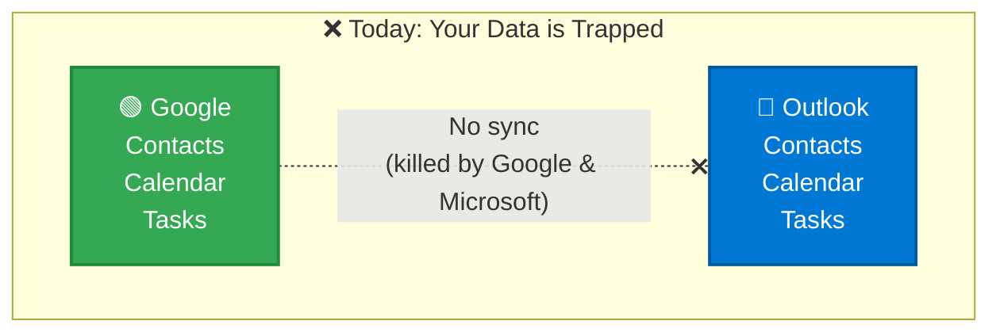
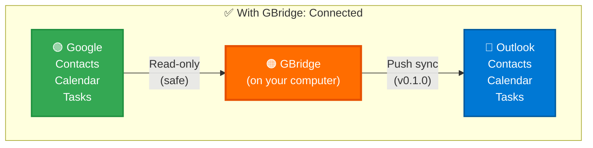
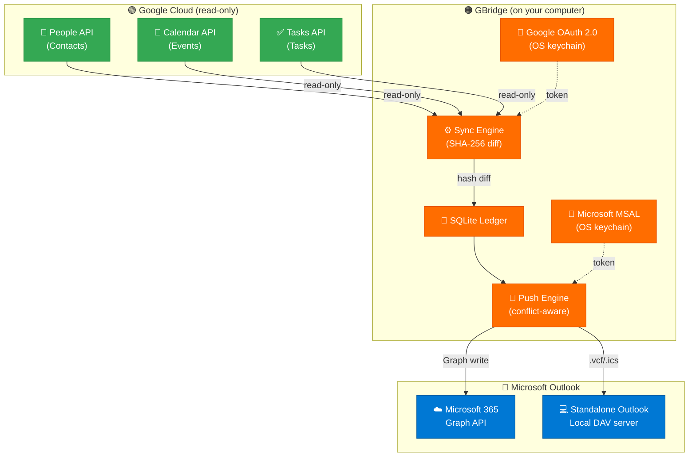
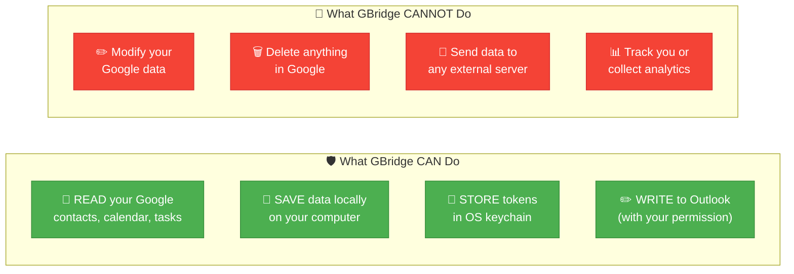

# GBridge

[](https://github.com/amitrintzler/GBridge/actions/workflows/ci.yml)
[](https://github.com/amitrintzler/GBridge/actions/workflows/security.yml)
[](https://github.com/amitrintzler/GBridge/releases/latest)
[](https://github.com/amitrintzler/GBridge/blob/main/LICENSE)
[](https://www.python.org/downloads/)
[](#safety-guarantees)
[](https://github.com/amitrintzler/GBridge/blob/main/SECURITY.md)
[](https://github.com/amitrintzler/GBridge)

**Sync your Google Contacts, Calendar, and Tasks with Microsoft Outlook.**

GBridge is a free, open-source tool that keeps your Google and Outlook data in sync — automatically, securely, and without touching your existing data. It runs entirely on your computer; your data never leaves your machine.

Created by **Amit Rintzler**.

---

## Why Does GBridge Exist?



**The problem is simple:** billions of people use Google for personal life and Outlook for work. Their contacts, calendars, and tasks live in two separate worlds that don't talk to each other.

**Why haven't Google or Microsoft fixed this?**

- **Google killed Google Sync** on December 14, 2012. ([Ars Technica](https://arstechnica.com/information-technology/2012/12/google-drops-exchange-activesync-support-for-free-accounts/), [The Verge](https://www.theverge.com/2012/12/14/3767626/google-drops-exchange-activesync-support-gmail))
- **Google also killed "Google Calendar Sync"** in 2014. ([Google Support](https://support.google.com/calendar/answer/89955))
- **Microsoft never built native Google sync into Outlook.** Their only option is a read-only calendar subscription — no contacts, no tasks, no real sync. ([Microsoft Support](https://support.microsoft.com/en-us/office/see-your-google-calendar-in-outlook-c1dab514-0ad4-4811-824a-7d02c5e77126))
- **Outlook desktop still doesn't support CalDAV/CardDAV** — the open standards that would make this trivial. Apple supports them natively. Microsoft chose not to.
- **Third-party tools exist, but all have catches:**

  | Tool | Price | Catches |
  |---|---|---|
  | [SyncGene](https://www.syncgene.com/) | $4.95–9.95/month | Routes data through their cloud servers |
  | [CompanionLink](https://www.companionlink.com/) | $14.95/month | Closed source, proprietary |
  | [gSyncit](https://www.gsyncit.com/) | $19.99 one-time | Windows-only, closed source |
  | [Sync2 Cloud](https://www.sync2.com/) | $49.95 one-time | Closed source, Windows-only |

**GBridge fixes this.** Free, open source, runs on your computer, your data never touches our servers (we don't have any). No subscription, no cloud middleman, no lock-in.



---

## Download & Install

### Windows

1. Download **`gbridge-windows.exe`** from the [Releases page](https://github.com/amitrintzler/GBridge/releases/latest)
2. Run it — no installation wizard needed, it's a self-contained executable
3. In a terminal: `gbridge setup`

> **Note:** Windows may show a SmartScreen warning on first run (the binary is not yet code-signed). Click **"More info → Run anyway"** to proceed. See [#pending-work](#pending-work) for the code-signing roadmap.

### macOS

1. Download **`gbridge-macos.dmg`** from the [Releases page](https://github.com/amitrintzler/GBridge/releases/latest)
2. Open the `.dmg` and drag **GBridge** to Applications
3. Open Terminal (Spotlight → "Terminal") and run:
   ```bash
   /Applications/GBridge.app/Contents/MacOS/gbridge setup
   ```

> macOS Gatekeeper may warn that the app is from an unidentified developer
> (it isn't notarized yet). Right-click GBridge → **Open**, or allow it under
> System Settings → Privacy & Security.

### Linux

1. Download **`gbridge-linux`** from the [Releases page](https://github.com/amitrintzler/GBridge/releases/latest)
2. Open a terminal and run:
   ```bash
   chmod +x ~/Downloads/gbridge-linux
   ~/Downloads/gbridge-linux setup
   ```

### Install from source (developers)

```bash
git clone https://github.com/amitrintzler/GBridge.git
cd GBridge
pip install -e ".[dev]"
gbridge setup
```

---

## First-time Setup (5 minutes, once only)

Run `gbridge setup`. The wizard walks you through:

**Step 1 — Google credentials**

You need a `client_secret.json` from the Google Cloud Console. The wizard opens the browser and guides you through exactly what to click:

```
  +----------------------------------------------------------+
  |  STEP A: Create a Google Cloud Project                   |
  +----------------------------------------------------------+
  |  1. Go to: https://console.cloud.google.com              |
  |  2. Click [NEW PROJECT], name it "GBridge"               |
  +----------------------------------------------------------+

  +----------------------------------------------------------+
  |  STEP B: Enable 3 APIs                                   |
  +----------------------------------------------------------+
  |  Search and ENABLE each:                                 |
  |    [x] People API                                        |
  |    [x] Google Calendar API                               |
  |    [x] Tasks API                                         |
  +----------------------------------------------------------+

  +----------------------------------------------------------+
  |  STEP C: Create OAuth Credentials                        |
  +----------------------------------------------------------+
  |  APIs & Services → Credentials → [+ CREATE CREDENTIALS] |
  |  → OAuth client ID → Desktop application                 |
  |  → [DOWNLOAD JSON] → rename to client_secret.json        |
  |  → place in %APPDATA%\GBridge\ (Windows) or              |
  |              ~/Library/Application Support/GBridge/ (Mac)|
  +----------------------------------------------------------+
```

**Steps 2–5** run automatically:

```
[Step 2/5] Google API credentials ... Found — OK
[Step 3/5] Signing in to Google ... (browser opens) ... Authenticated — OK
[Step 4/5] Running your first sync ...
  Contacts       342 items synced
  Events         128 items synced
  Tasks           15 items synced
[Step 5/5] Outlook detection ...
  Microsoft 365 detected — ready for Outlook push
========================================================
  Setup complete! GBridge is ready.
========================================================
```

**Step 6 (optional) — Outlook write-back**

To push Google data into Outlook you need a free Microsoft Azure app
registration (one-time, ~3 minutes). **Full step-by-step with screenshots of
each field: [docs/AZURE_SETUP.md](docs/AZURE_SETUP.md).**

Short version:

1. [portal.azure.com](https://portal.azure.com) → **App registrations → New registration**
2. Name `GBridge`; account types **"any org directory + personal"**; Redirect URI **Public client/native** → `http://localhost`
3. **Authentication → Allow public client flows → Yes**
4. **API permissions → Microsoft Graph → Delegated:** `Contacts.ReadWrite`, `Calendars.ReadWrite`, `Tasks.ReadWrite`
5. Copy the **Application (client) ID**, then run:
   ```bash
   gbridge outlook auth --client-id <YOUR_GUID>
   ```
6. Set `"outlook_mode": "graph"` in `config.json`, then `gbridge outlook push`
   (or let `gbridge daemon` do it on a schedule).

Verify any time with **`gbridge doctor`**.

---

## How It Works



**How the sync works:**
1. GBridge reads your Google data (read-only scopes — cannot modify anything in Google)
2. Each item is fingerprinted with SHA-256; only real changes are recorded in the local SQLite ledger
3. The push engine compares the ledger against what's in Outlook and writes only the differences
4. If the same item was edited in both Google and Outlook since the last push, a **conflict** is recorded — you pick the winner via the tray menu or CLI

**Two Outlook paths:**
- **Microsoft 365** — writes via Microsoft Graph API (`/me/contacts`, `/me/calendars`, `/me/todo/lists`)
- **Standalone classic Outlook** — runs an embedded Radicale DAV server on `localhost:8765` and renders the ledger as `.vcf` (contacts) and `.ics` (calendar/tasks) files; the bundled [Outlook CalDav Synchronizer](https://github.com/aluxnimm/outlookcaldavsynchronizer) addin reads them into Outlook

---

## Commands

### Core

| Command | What it does |
|---|---|
| `gbridge setup` | **First-time setup wizard** |
| `gbridge doctor` | **Self-check — what's configured and what's missing** |
| `gbridge` | Run a Google sync (default command) |
| `gbridge status` | Show ledger counts and last sync time |
| `gbridge auth` | Re-authenticate with Google |
| `gbridge --version` | Show version |

### Outlook write-back (Phase 2)

| Command | What it does |
|---|---|
| `gbridge outlook auth --client-id GUID` | Sign in to Microsoft (saves GUID to config) |
| `gbridge outlook push` | Push ledger → Outlook (one-shot) |
| `gbridge outlook push --dry` | Show what would be pushed without writing |
| `gbridge outlook status` | Show push state, mode, conflict count |

### Conflict resolution

| Command | What it does |
|---|---|
| `gbridge conflicts list` | List items changed on both sides since last push |
| `gbridge conflicts resolve ID --winner google` | Keep the Google version |
| `gbridge conflicts resolve ID --winner outlook` | Keep the Outlook version |

### Background service

| Command | What it does |
|---|---|
| `gbridge daemon` | Start background service with tray icon |
| `gbridge autostart install` | Launch GBridge automatically on login |
| `gbridge autostart remove` | Remove autostart |
| `gbridge autostart status` | Check if autostart is installed |
| `gbridge gui` | Open the Tkinter setup wizard |

---

## Background Daemon & Tray

`gbridge daemon` runs GBridge as a background service:

- **Auto-sync** on a configurable interval (default: every 15 minutes)
- **Auto-push** to Outlook after each sync (if configured)
- **System tray icon** with quick actions:
  - Sync now
  - Push to Outlook
  - Resolve conflicts (N) — appears only when conflicts are pending
  - Show status
  - Quit
- **Toast notifications** after each sync/push

To start on login: `gbridge autostart install`

---

## Safety Guarantees



### 1. Google data is read-only — always

The exact scopes in [`src/gbridge/config/defaults.py`](https://github.com/amitrintzler/GBridge/blob/main/src/gbridge/config/defaults.py):

```python
GOOGLE_SCOPES = [
    "https://www.googleapis.com/auth/contacts.readonly",
    "https://www.googleapis.com/auth/calendar.readonly",
    "https://www.googleapis.com/auth/tasks.readonly",
]
```

Every scope ends in `.readonly`. Google enforces this server-side — even if our code tried to write, Google would reject the request. The consent screen will say **"View your contacts"**, not "Edit your contacts".

### 2. No fuzzy matching — tracked by Google IDs

Items are matched by Google-assigned unique IDs:
- Contacts: `resource_name` (e.g. `people/c1234567890`)
- Events: `event_id`
- Tasks: `task_id`

No guessing, no name matching. If the ID doesn't match, it's treated as a different item.

### 3. SHA-256 fingerprinting — only real changes

Every item is hashed. If the hash matches the last sync, the item is skipped entirely. This means a sync with no real changes is always a no-op.

### 4. Local-only — no external servers

The only outbound connections are to `googleapis.com` and `graph.microsoft.com`. There are no telemetry endpoints, analytics SDKs, or phone-home URLs. Verify yourself:

```bash
grep -r "http" src/gbridge/ --include="*.py" \
  | grep -v googleapis | grep -v google.com \
  | grep -v graph.microsoft.com | grep -v login.microsoftonline.com \
  | grep -v localhost | grep -v github.com
```

### 5. OS keychain token storage

Both Google and Microsoft tokens are stored via the `keyring` library — never written to plain-text files:
- **Windows**: Windows Credential Locker
- **macOS**: macOS Keychain
- **Linux**: GNOME Secret Service / KWallet

### 6. Automated security scanning on every commit

| Check | What it scans | Frequency |
|---|---|---|
| [Ruff security rules](https://github.com/amitrintzler/GBridge/blob/main/pyproject.toml) | Injection, hardcoded secrets, crypto misuse | Every commit |
| [Bandit](https://github.com/amitrintzler/GBridge/actions/workflows/security.yml) | Deep static security analysis | Every commit |
| [pip-audit](https://github.com/amitrintzler/GBridge/actions/workflows/security.yml) | Known CVEs in dependencies | Every commit + weekly |
| [CodeQL](https://github.com/amitrintzler/GBridge/actions/workflows/security.yml) | Semantic code analysis | Every commit |
| [SBOM](https://github.com/amitrintzler/GBridge/actions/workflows/security.yml) | Full dependency bill of materials | Every release |

---

## Where Is My Data?

| What | Windows | macOS | Linux |
|---|---|---|---|
| Config + database | `%APPDATA%\GBridge\` | `~/Library/Application Support/GBridge/` | `~/.config/gbridge/` |
| Google token | Windows Credential Locker | macOS Keychain | Secret Service |
| Microsoft token | Windows Credential Locker | macOS Keychain | Secret Service |
| DAV collections | `%LOCALAPPDATA%\GBridge\dav\` | `~/.local/share/GBridge/dav/` | `~/.local/share/gbridge/dav/` |
| Logs | Config folder / `logs/` | Config folder / `logs/` | Config folder / `logs/` |

---

## Configuration

Settings live in `config.json` inside the config directory. Key options:

| Setting | Default | Description |
|---|---|---|
| `sync_interval_minutes` | `15` | How often to sync from Google |
| `push_interval_minutes` | `15` | How often to push to Outlook |
| `outlook_mode` | `disabled` | `disabled` \| `graph` (M365) \| `dav` (standalone) |
| `microsoft_client_id` | _(empty)_ | Your Azure app GUID (set via `gbridge outlook auth`) |
| `enabled_calendars` | `[]` | Limit sync to specific calendar IDs (empty = all) |
| `enabled_tasklists` | `[]` | Limit sync to specific tasklist IDs (empty = all) |

---

## Troubleshooting

**"The setup wizard says it can't find `client_secret.json`"**
Follow the visual guide — it tells you exactly where to save the file. On Windows: `%APPDATA%\GBridge\client_secret.json`.

**"Browser doesn't open for Google sign-in"**
Copy the URL from the terminal and paste it into your browser manually.

**"Authentication failed" / "401 Unauthorized"**
Run `gbridge auth` to re-authenticate. Make sure you enabled all 3 APIs in the Google Cloud Console (People API, Google Calendar API, Tasks API).

**"Microsoft sign-in says client_id is not configured"**
You need to register a free Azure app and run `gbridge outlook auth --client-id <YOUR_GUID>`. See [First-time Setup](#first-time-setup-5-minutes-once-only) above.

**"Windows shows a SmartScreen warning"**
Click **"More info" → "Run anyway"**. This happens because the binary is not yet code-signed. This is on the [roadmap](#pending-work).

**Want to start fresh?**
Delete the config folder (see [Where Is My Data?](#where-is-my-data)) or run `gbridge auth` to just reset credentials.

---

## Pending Work

The following items are tracked in [BACKLOG.md](BACKLOG.md) and planned for upcoming releases:

### Near-term (v0.2.0)
| Item | Notes |
|---|---|
| **Ship a bundled Azure app client_id** | Today users must register their own (2-min setup). A future release will ship a registered GBridge app so Outlook write-back works out-of-the-box. |
| **Windows code signing** | Remove the SmartScreen warning. Requires an Authenticode certificate. |
| **NSIS installer testing** | End-to-end: install → shortcuts → uninstall → clean. |
| **macOS .dmg creation** | Wrap the binary in a proper disk image. |
| **Linux .deb / .rpm packages** | Distribution-native packaging. |

### Medium-term (v0.3.0)
| Item | Notes |
|---|---|
| **Two-way sync** | Today GBridge is one-directional: Google → Outlook. True two-way sync (edits in Outlook flow back to Google) requires write scopes on Google, which is a bigger design decision. |
| **Google Tasks subtask hierarchy** | Graph To Do has no parent/child concept; subtasks currently land as siblings in Outlook. |
| **Full RRULE support** | Common recurrence patterns (daily/weekly/monthly/yearly) work. Rarer clauses (BYSETPOS, BYYEARDAY, EXDATE lists) are best-effort on Graph; byte-perfect on DAV. |
| **Multi-calendar selection UI** | A picker in the setup wizard to choose which Google calendars and tasklists to sync (config fields exist, UI not yet wired). |
| **Sync progress indicators** | Progress bars in CLI and Tk wizard for large accounts. |

### Known limitations (v0.1.0)
- **Google data cannot be modified** — read-only by design, enforced at the API level
- **Task subtask nesting** is not preserved in Outlook (Graph To Do limitation)
- **Graph To Do statuses** `inProgress`, `waitingOnOthers`, `deferred` collapse to `needsAction` when mapping back to Google format
- **DAV conflict detection** is delegated to the Outlook CalDav Synchronizer addin; GBridge is the authoritative source and rewrites on each push

---

## For Developers

### Project structure

```
src/gbridge/
  __main__.py           # CLI entry point (all subcommands)
  core/
    engine.py           # Google sync orchestrator
    pusher.py           # Outlook push engine (dry/graph/dav modes)
    ledger.py           # SQLite ledger (v3 schema)
    hasher.py           # SHA-256 content fingerprinting
    conflicts.py        # Conflict record/resolve helpers
  google/
    auth.py             # Google OAuth 2.0 + OS keychain
    people.py           # Contacts API (delta sync)
    calendar.py         # Calendar API (delta sync)
    tasks.py            # Tasks API
    models.py           # GoogleContact / GoogleEvent / GoogleTask
  microsoft/
    auth.py             # MSAL public-client + OS keychain
    models.py           # MicrosoftContact / Event / Task
    mapping.py          # Google <-> Graph field mapping + RRULE parser
    _http.py            # Graph HTTP client (429/410/412 handling)
    graph_people.py     # /me/contacts CRUD + delta
    graph_calendar.py   # /me/calendars + events CRUD + delta
    graph_tasks.py      # /me/todo/lists + tasks CRUD
  dav/
    server.py           # Radicale subprocess supervisor
    storage.py          # Ledger -> .vcf/.ics projector
    ocs_config.py       # Outlook CalDav Synchronizer profile XML
  outlook/
    detect.py           # M365 vs standalone detection
  gui/
    wizard.py           # Tkinter setup wizard
    conflicts.py        # Tkinter conflict resolution dialog
  config/
    settings.py         # JSON config with typed properties
    defaults.py         # Constants (scopes, keyring keys, defaults)
  utils/
    logger.py           # Rotating file logger
    backoff.py          # Exponential backoff + Retry-After
    scheduler.py        # APScheduler (sync + push jobs)
    tray.py             # pystray system tray
    notify.py           # plyer toast notifications
    resources.py        # Bundled asset paths (PyInstaller-aware)
  service/
    windows.py          # HKCU Run-key autostart
    macos.py            # LaunchAgent plist autostart
    linux.py            # systemd-user autostart
  daemon.py             # Orchestrator: sync + push + Radicale + tray
installer/
  windows/              # NSIS script + build.bat
  macos/                # build.sh
  linux/                # build.sh
tests/                  # 269 unit tests, 80% coverage
```

### Run tests

```bash
pytest tests/ -v
pytest tests/ --cov=src/gbridge --cov-report=term-missing  # with coverage
ruff check src/ tests/                                      # lint
mypy src/gbridge/ --ignore-missing-imports                  # types
bandit -c pyproject.toml -r src/gbridge                    # security
```

### Build installers locally

```bash
# CI builds automatically on every v* tag.
# For local builds:

# Windows
installer\windows\build.bat

# macOS / Linux
bash installer/macos/build.sh
bash installer/linux/build.sh
```

Installers are also built automatically by GitHub Actions on every release tag and attached to the [Releases page](https://github.com/amitrintzler/GBridge/releases).

---

## License

MIT License. See [LICENSE](LICENSE) for details.

Third-party component: [Outlook CalDav Synchronizer](https://github.com/aluxnimm/outlookcaldavsynchronizer) (MIT / MPL-2.0) — optionally bundled in the Windows installer for the standalone-Outlook DAV path.
